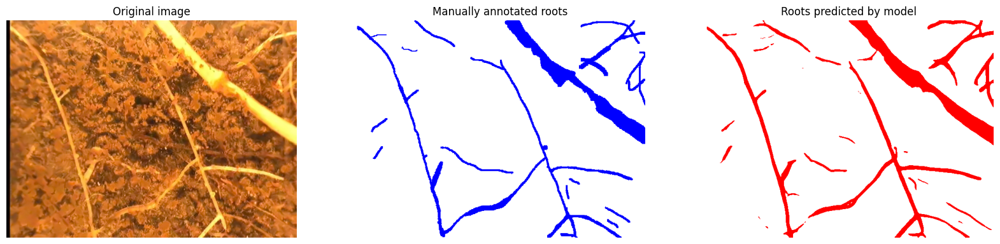

# Root Segmentation in SubArctic Grasslands: RS_SAG

[](https://python.org)
[](https://pytorch.org)
[](LICENSE)

Code for automatic root segmentation of images from BARTZ system, from subarctic grasslands, and further calculations of total root length (TRL) and total root area (TRA). 
The repository also includes the Label tool, which was used for labeling the training dataset.


Segmentation example.

| File | Description |
|------|-------------|
| `RS_SAG_data_generation_loop.ipynb` | Execution of the whole pipeline, from loading to segmenting, to calculating TLR and TRA, to saving the results |
| `RS_SAG_results_summary-Copy1.ipynb` | Summary of different methods tried for calculations, including depth profile and test of the model |
| `Label tool/segment_BARTZ_images_tool.py` | PyQt5 GUI for manual root annotation |

### Citation

```bibtex
@misc{Baykalov2024scripts,
  Author = {Pavel Baykalov},
  Title = {Root Segmentation in SubArctic Grasslands: RS_SAG},
  Year = {2024},
  Publisher = {GitHub},
  Journal = {GitHub repository},
  Howpublished = {\url{https://https://github.com/dIcarusb/Root-segmentation_subArctic-Grassland-RS_SAG-/tree/main}}
}
```
